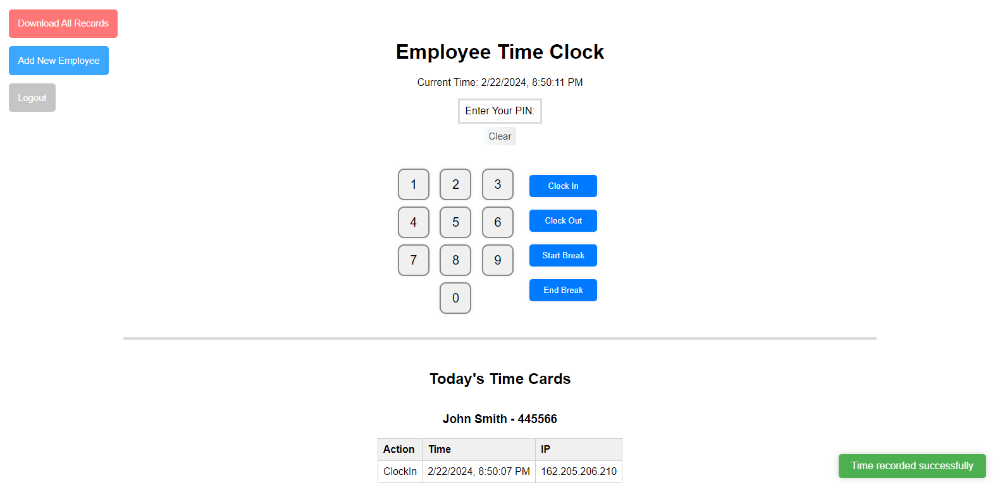

# 🕙 Employee Time Clock 🕐

A simple web-based employee time clock application built with React.

## Requirements

- [Node.js](https://nodejs.org/)

## Installation

1. **Clone the Repository**

   ```bash
   git clone https://github.com/judahpaul16/employee-time-clock.git
   cd employee-time-clock
   ```
   
2. **Install Dependencies**

   ```bash
   npm i
   ```

3. **Start the Application** (Development)

   ```bash
   # builds the frontend and serves the app on port 3001
   npm run dev
   ```

4. **Build the Application** (Production)

   ```bash
   # builds application in the 'dist' folder
   npm run build
   ```

## Configuration (environment variables)

Set these on the hosting service (Render → service → Environment). Never commit them.

| Variable | Required | Purpose |
|---|---|---|
| `MONGODB_URI` | yes | MongoDB Atlas connection string |
| `SESSION_SECRET` | recommended | Any long random string. Keeps admins logged in across restarts |
| `DISCORD_WEBHOOK_URL` | optional | Channel for clock-in/out/break notifications |
| `ABSENCE_WEBHOOK_URL` | optional | Channel for "marked absent" alerts |
| `CRON_SECRET` | for auto clock-out | Shared secret for the scheduled auto clock-out job |
| `AUTO_CLOCKOUT_ENABLED` / `AUTO_CLOCKOUT_HOUR` / `AUTO_CLOCKOUT_MINUTE` | optional | Defaults: enabled, 16:30 PST |

### Auto clock-out

The server clocks everyone out at 4:30 PM PST (needs an always-on instance).
`POST /cron/auto-clockout` with header `x-cron-secret: $CRON_SECRET` triggers the same
clock-out from an external scheduler if the server ever runs on a plan that sleeps.

## Usage

- Employees can navigate to their unique URL to clock in/out.
- Administrators can log in to the dashboard to view and manage time logs.

<!-- screenshot -->


## Example reclone script for production (Linux + Phusion Passenger)

   ```bash
   #!/bin/bash

   # Print the warning message
   echo ""
   echo "This script will reset the employee time clock database."
   
   # Prompt the user for confirmation
   read -p "Are you sure you want to continue? (y/n): " response
   
   # Check if the response is 'y' or 'Y'
   if [[ "$response" == "y" || "$response" == "Y" ]]; then
     echo "Recloning..."
     echo ""
   else
     echo "Operation canceled."
     echo ""
     exit 0
   fi
   
   rm -rf 'employee-time-clock/'
   git clone https://github.com/judahpaul16/employee-time-clock.git
   cd employee-time-clock
   npm i && npm rebuild bcrypt --build-from-source && npm run build && mkdir ./tmp && touch ./tmp/restart.txt
